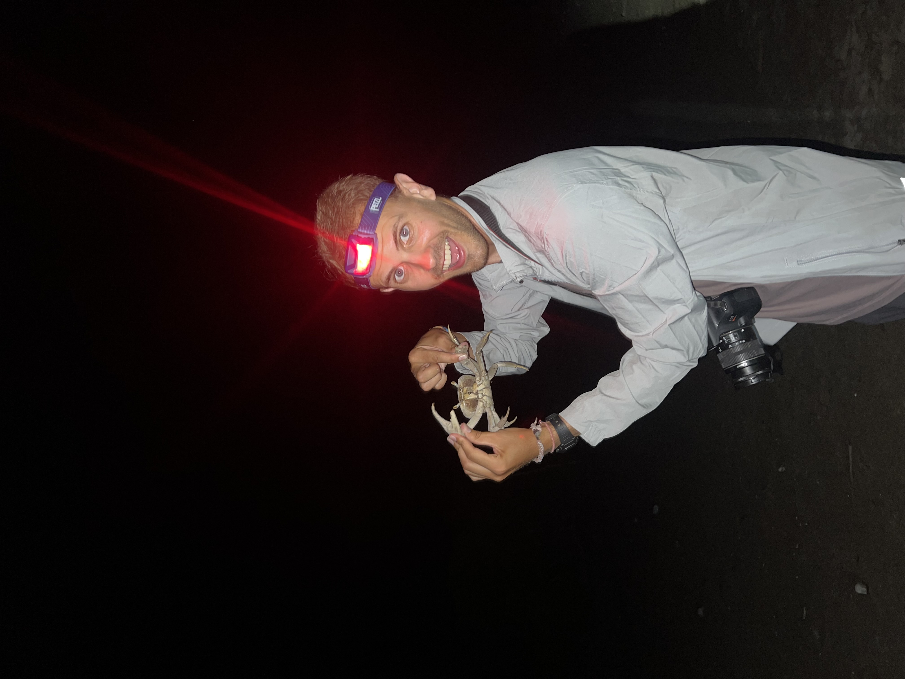

```{r setup, include = FALSE, message=FALSE, warning=FALSE}
library(here)
```


# Education and Career Interests

I was born and raised in San Angelo, Texas. I graduated summa cum laude from Texas Tech University in 2021 with a Bachelor of Science degree in Biology and went on to earn a master's degree in Environmental Science and Management (with a specialization in Coastal Marine Resources Management) from the Bren School at the University of California, Santa Barbara in 2023. During my time as a graduate student, I took classes in everything from environmental economics and law, to coastal policy and management, to environmental media production, and developed skills in data management and analysis, communications, and marine ecology. I also worked with four amazing groupmates, our advisor Dr. Ben Halpern, Conservation International, and the Save the Waves Coalition to complete a master's group project titled "Integrating Ecosystem Services into a Prioritization Model for Surf Protected Areas," for which I conducted an ecosystem service assessment of surf breaks in Brazil and used that to help prioritize breaks for inclusion in marine protected areas. Since graduating with my master's, I earned my PADI Divemaster certification and started working as a Waterfront Assistant for The School for Field Studies Center for Marine Resource Studies in the Turks and Caicos Islands, where I studied abroad as an undergraduate and originally fell in love with the ocean. I love introducing our students to the beauty of the ocean and helping them develop into marine scientists. Through diving, research projects, coral restoration work, social media posts, and more, I am continually cultivating my marine conservation skills which I hope to apply to future work with other environmental nonprofits dedicated to protecting and restoring our oceans.

# Hobbies




In my free time I enjoy hiking, traveling, scuba diving, photography, and tennis. When I am stateside you can usually find me outdoors with my lovely blue heeler Willow.


